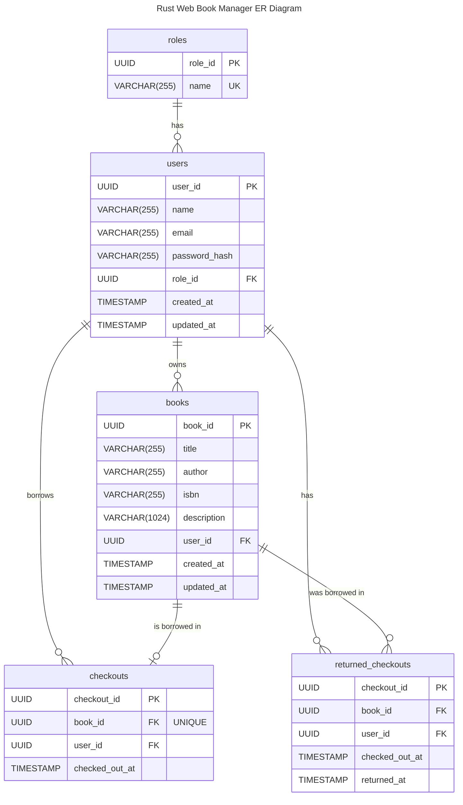

```mermaid
---
title: "Rust Web Book Manager ER Diagram"
---
erDiagram
    roles ||--o{ users : "has"
    users ||--o{ books : "owns"
    users ||--o{ checkouts : "borrows"
    users ||--o{ returned_checkouts : "has"
    books ||--o| checkouts : "is borrowed in"
    books ||--o{ returned_checkouts : "was borrowed in"

    roles {
        UUID role_id PK
        VARCHAR(255) name UK
    }

    users {
        UUID user_id PK
        VARCHAR(255) name
        VARCHAR(255) email
        VARCHAR(255) password_hash
        UUID role_id FK
        TIMESTAMP created_at
        TIMESTAMP updated_at
    }

    books {
        UUID book_id PK
        VARCHAR(255) title
        VARCHAR(255) author
        VARCHAR(255) isbn
        VARCHAR(1024) description
        UUID user_id FK
        TIMESTAMP created_at
        TIMESTAMP updated_at
    }

    checkouts {
        UUID checkout_id PK
        UUID book_id FK "UNIQUE"
        UUID user_id FK
        TIMESTAMP checked_out_at
    }

    returned_checkouts {
        UUID checkout_id PK
        UUID book_id FK
        UUID user_id FK
        TIMESTAMP checked_out_at
        TIMESTAMP returned_at
    }
```